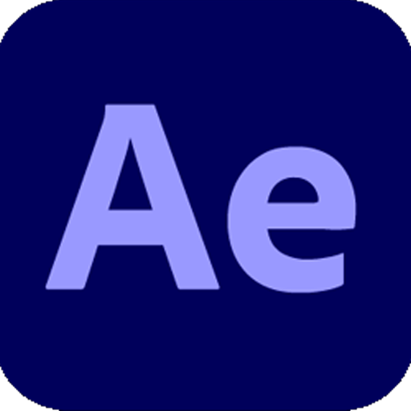

# 🌐 Yoscar Manuel | Portafolio Digital

¡Bienvenido a mi portafolio digital! 🎉


---

## 🏠 Inicio

Hola, soy **Yoscar**. Soy **Diseñador Gráfico** y **Desarrollador Web** en formación. Aquí encontrarás una muestra de mis habilidades y proyectos. ¡Explora y descubre más sobre mi trabajo!


---

## 🚀 Proyectos

### 🎨 MJStudio | Discord Bot
- **Rol:** Creador & Desarrollador
- **Tecnología:** JavaScript
- 

---

## 👨‍💻 Sobre Mí

Hola 👋, soy Yoscar Manuel, tengo 17 años y resido en la **República Dominicana**. Soy **Diseñador Gráfico** y **Desarrollador Web Front-End**. Estoy comprometido a crear sitios web interactivos y estéticamente agradables, aprovechando mis habilidades de diseño gráfico para ofrecer una experiencia de usuario excepcional.

---

## 🛠️ Habilidades

### Web Development
-  **HTML**
-  **CSS**
-  **Java**
-  **JavaScript**

### Diseño Gráfico
-  **Illustrator**
-  **Photoshop**
-  **After Effects**
-  **Premiere**
-  **InDesign**

---

## 📞 Contacto

¿Tienes algún proyecto en mente? ¡Hablemos!

[](#)

---

## 📢 Redes Sociales

¡Sígueme en mis redes sociales!

- [Instagram](https://www.instagram.com/yoscarmjp/) 📸
- [LinkedIn](https://www.linkedin.com/in/superyoscar/) 💼
- [GitHub](https://github.com/yoscarmjp/) 💻

---

## © Copyright

**MJStudio 2024. All rights reserved**

---

## 🚀 Cómo Ejecutar el Proyecto Localmente

1. Clona el repositorio:
    ```sh
    git clone https://github.com/yoscarmjp/Portafolio.git
    ```

2. Navega al directorio del proyecto:
    ```sh
    cd Portafolio
    ```

3. Abre `index.html` en tu navegador favorito.

---

¡Gracias por visitar mi portafolio! 🌟
